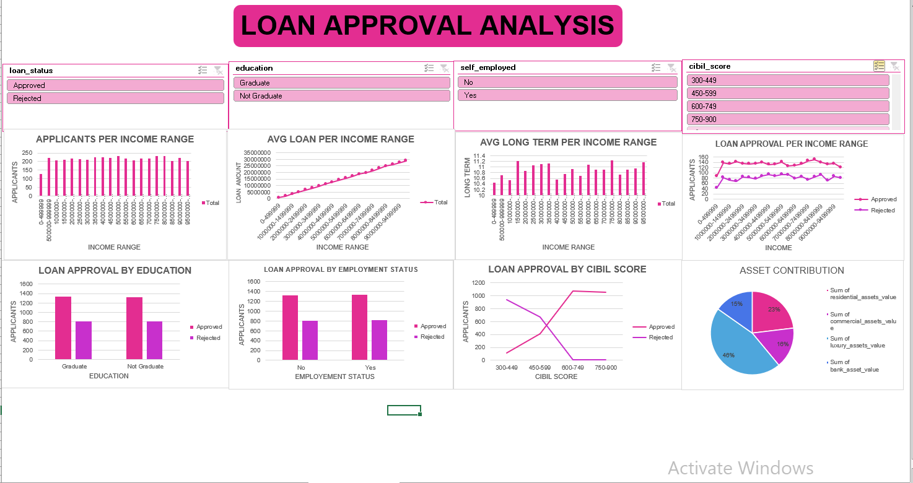

# Loan Approval Analysis  

This project presents an interactive **Excel dashboard** for analyzing loan approvals based on multiple factors such as income, education, employment status, CIBIL score, and asset contribution. The dashboard helps in understanding loan approval patterns and applicant behavior.  

## Key Insights  

- **Applicants per Income Range:** Distribution of loan applicants across different income levels.  
- **Average Loan Amount by Income Range:** Shows how loan amount increases steadily with higher income.  
- **Average Loan Term by Income Range:** Displays how loan tenures vary across different income groups.  
- **Loan Approval vs Rejection by Income Range:** Tracks approval/rejection trends across income levels.  

### Loan Approval Breakdown  
- **By Education:** Both graduates and non-graduates apply for loans, but approval rates vary.  
- **By Employment Status:** Self-employed vs. non-self-employed applicants show different approval patterns.  
- **By CIBIL Score:** Applicants with **higher CIBIL scores (600–900)** have significantly higher approval chances.  

### Assets Contribution  
- Breakdown of applicant assets shows contributions from:  
  - Residential Assets  
  - Commercial Assets  
  - Luxury Assets  
  - Bank Assets  

## Features  

- Interactive **slicers** for filtering by loan status, education, employment status, and CIBIL score.  
- Multiple comparative visualizations to identify trends.  
- Pie chart to analyze asset contribution.  

## Dashboard Preview  

  

